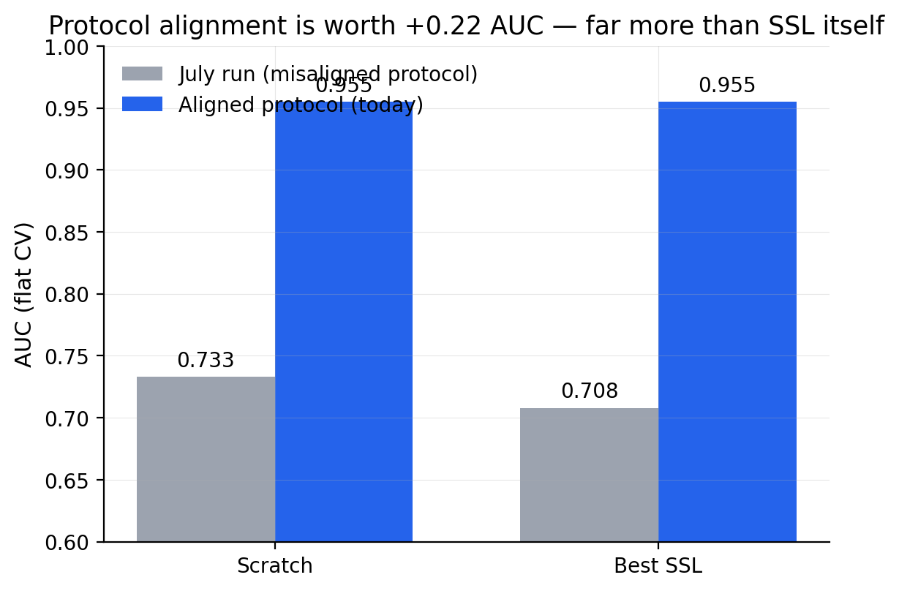
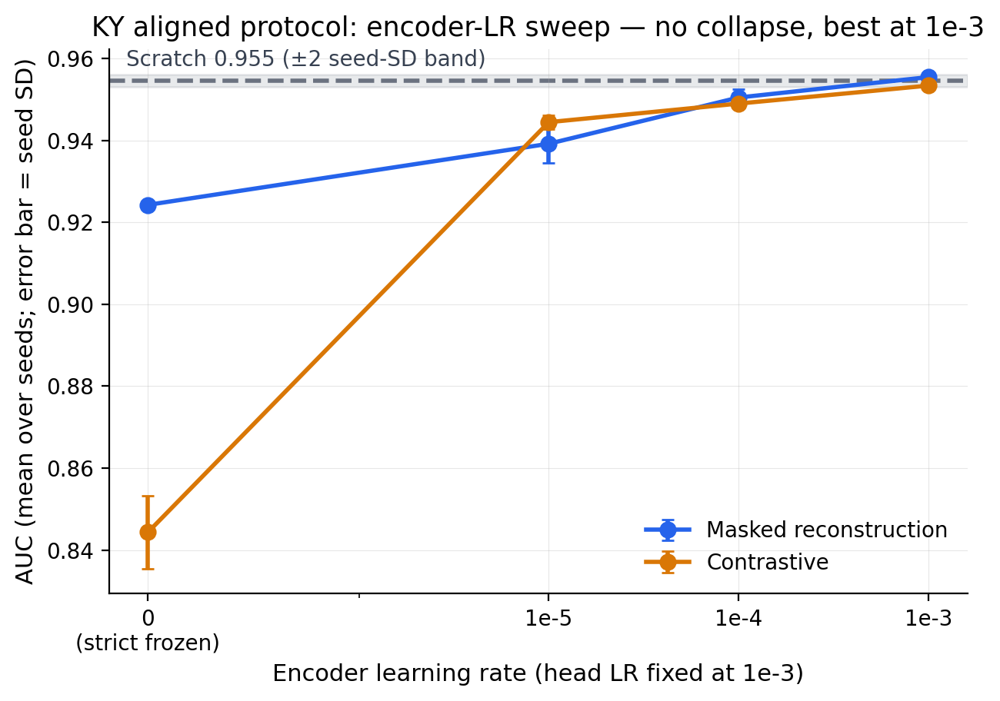
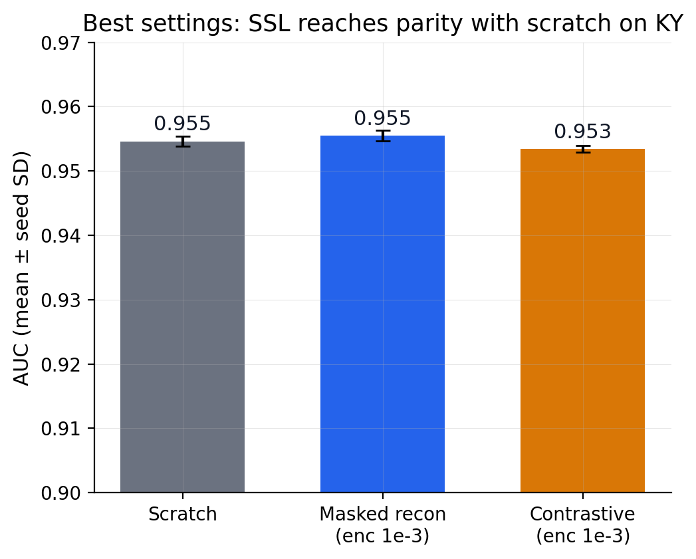
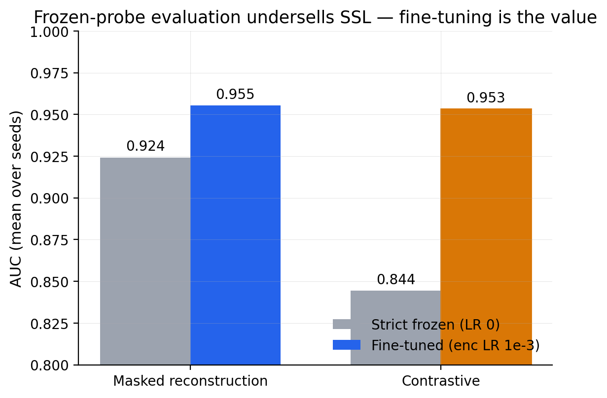
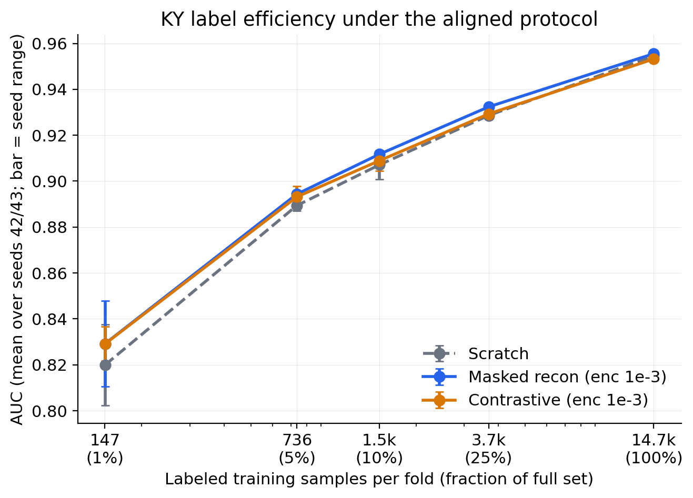
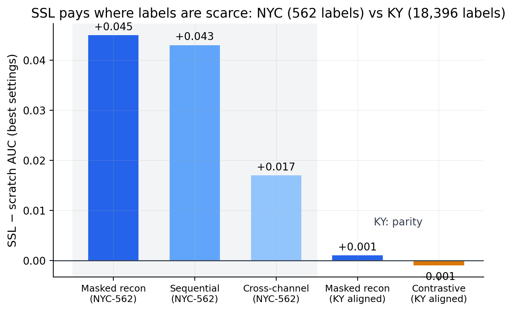
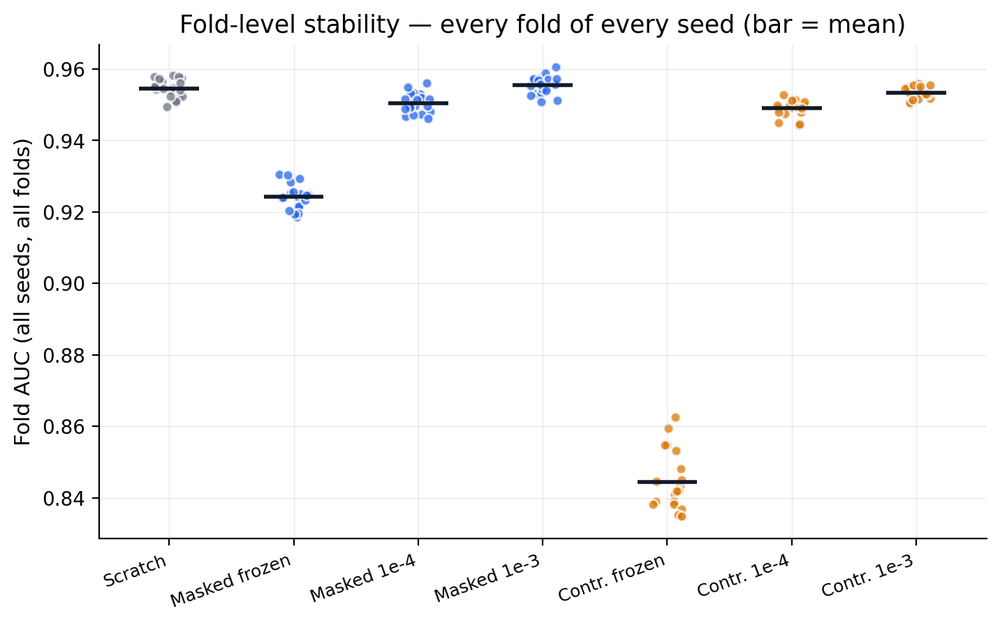
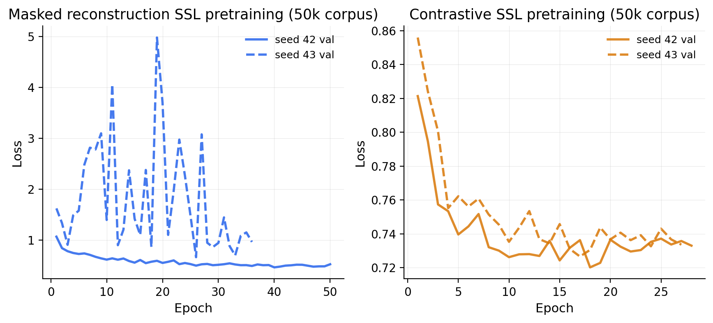

# Kentucky under Qianyi's aligned protocol — full results, 2026-07-17
### One-file presentation pack (all figures in `figures/KY_dual_view_aligned/`)

---

## 0. One-slide summary

> **We fully aligned Kentucky to Qianyi's dual-view protocol and re-ran everything
> today (seeds 42–45, two GPUs, ~$9). Three findings:**
> 1. **The protocol was worth +0.22 AUC** (0.73 → 0.955). The July "SSL hurts KY"
>    result was a protocol artifact — Qianyi's diagnosis was correct.
> 2. **SSL now reaches parity with scratch on KY** (masked recon 0.955 vs scratch
>    0.955), but does not beat it — unlike NYC-562, where SSL wins by +0.03–0.05.
> 3. **The SSL advantage grows as labels shrink** (today's label-efficiency rerun:
>    +0.001 at 14.7k labels → +0.009 at 147) — two-region support for the thesis
>    that SSL pays where labels are scarce.

**Setup in one line:** dual-view 15×15/31×31 shared ResNet-18, 13 factors + context
mask, masked-recon (ratio 0.5, blocks 3×3/4×4) + contrastive SSL on 50,000 unlabeled
KY centers, PU mean-OOB 1:1 labeled set (9,198+9,198), head LR 1e-3, encoder-LR sweep
{0, 1e-5, 1e-4, 1e-3}, strict LR=0 freeze (weights + BN, hash-verified), batch 128,
pos_weight BCE, group-safe flat CV (StratifiedGroupKFold by KGS feature — zero
same-landslide train/test leaks), seeds 42–45.

---

## 1. What actually changed — July setup vs the aligned protocol we now follow

| Setting | July KY runs (misaligned) | NOW (Qianyi-aligned, today's run) |
|---|---|---|
| **Architecture / views** | single-view ResNet-18, one 64×64 patch | **dual-view shared ResNet-18: 15×15 local + 31×31 global**, fused `logit = local + 0.2·global` |
| **Input channels** | 13 factors + context mask (same) | 13 factors + context mask (same; ksat in slot 6) |
| **SSL pretraining corpus** | 3,000 unlabeled patches | **50,000 unlabeled centers** |
| **SSL tasks/config** | our masked-recon & cross-channel defaults, 60 ep | **his spec: masked recon ratio 0.5, spatial blocks 3×3 local / 4×4 global, reconstruct 13 factor channels only, LR 1e-4; contrastive LR 1e-3; batch 64, ≤50 ep, patience 10** |
| **Negatives (labeled set)** | buffered-random negatives | **PU mean-OOB selected negatives** (RF 50×100 on 50k candidates, keep mean-OOB ≤ 0.5 — harder negatives) |
| **Class balance** | 1 : 2 (9,198 : 18,396) | **1 : 1 (9,198 : 9,198)** |
| **Head LR** | 2e-5 | **1e-3** |
| **Encoder LR** | fixed 5e-6 | **swept {0, 1e-5, 1e-4, 1e-3}**, two optimizer groups |
| **LR=0 semantics** | n/a | **strict freeze: weights AND BN statistics** (hash-verified) |
| **Loss** | plain BCE | **BCE with pos_weight** |
| **Batch size (downstream)** | 32 | **128**, ≤100 ep, patience 15, AdamW wd 1e-4, AMP |
| **CV split** | StratifiedKFold(5) on label | **StratifiedGroupKFold(5) grouped by KGS `original_feature_id`** — zero same-landslide train/test leaks (our leak-fix on top of his flat CV) |
| **Seeds** | 1–3 (partial, pod died) | **42–45 complete** (his list is 42–46) |
| **Result** | scratch 0.733, SSL 0.665–0.708 (SSL "hurts") | **scratch 0.955, SSL 0.953–0.955 (parity)** |

Every row except the CV split is a straight adoption of Qianyi's protocol (verified
against his code, with his 07-13 Slack overriding code defaults where they differ:
50k corpus, strict LR=0 freeze, encoder-LR range up to 1e-3). The CV-split row is
our addition — it only makes the test *harder*, so the numbers are conservative.

---

## 2. Main table (seed-level mean ± SD)

| Model | Encoder LR | AUC mean ± SD | worst fold | Δ vs scratch |
|---|---|---|---|---|
| **Scratch (full model, LR 1e-3)** | — | **0.955 ± 0.001** (n=4) | 0.949 | — |
| **Masked reconstruction** | **1e-3 (best)** | **0.955 ± 0.001** (n=4) | 0.951 | **+0.001** |
| Masked reconstruction | 1e-4 | 0.950 ± 0.002 (n=4) | 0.946 | −0.004 |
| Masked reconstruction | 1e-5 | 0.939 ± 0.005 (n=4) | 0.926 | −0.015 |
| Masked reconstruction | frozen (strict) | 0.924 ± 0.001 (n=4) | 0.919 | −0.030 |
| **Contrastive** | **1e-3 (best)** | **0.953 ± 0.001** (n=4) | 0.950 | **−0.001** |
| Contrastive | 1e-4 | 0.949 ± 0.000 (n=4) | 0.944 | −0.006 |
| Contrastive | 1e-5 | 0.945 ± 0.001 (n=4) | 0.940 | −0.009 |
| Contrastive | frozen (strict) | 0.844 ± 0.009 (n=4) | 0.835 | −0.110 |

Rule of the lab: a difference is real only if it clears ~2× the seed SD (~0.002 here).
The best-SSL deltas (±0.001) do **not** clear it → **parity**, honestly stated.

---

## 3. Figures, in presentation order

### F3 — Protocol alignment effect (open with this)

July's misaligned run (single-view 64×64, 3k SSL corpus, buffered-random negatives
1:2, head LR 2e-5): scratch 0.733, best SSL 0.708. Today, same region, same labels
source, aligned protocol: both ~0.955. **Alignment moved the numbers 50× more than
pretraining does.** This retires the July "SSL hurts KY" conclusion and validates
Qianyi's feedback point by point.

### F1 — Encoder-LR sweep (the methodology figure)

Both SSL tasks improve **monotonically** with encoder LR and converge into the
scratch ±2-SD band at 1e-3 (top of Qianyi's stated range). **No collapse at any
encoder LR under head LR 1e-3** — our old "collapse at enc 1e-4" was an artifact of
the 2e-5 head LR, confirming his report. Strict LR=0 freeze verified by
encoder/BN state hashes.

### F2 — Best settings (the parity figure)

At each method's best setting the three bars are statistically indistinguishable.
Say it plainly: on KY at full supervision, SSL neither helps nor hurts.

### F7 — Frozen probes undersell SSL

Strict-frozen evaluation costs 0.030 (masked) / 0.110 (contrastive) AUC vs
fine-tuning. Any comparison of SSL methods via frozen probes on this data would
rank them wrong and undersell both.

### F8 — Label efficiency (today's rerun — the thesis figure)

Re-run **today under the aligned protocol** (reusing today's encoders; fractions of
each fold's train set, identical label subsets across methods; seeds 42/43 — n=2,
preliminary):

| train labels/fold | scratch | masked recon | Δ |
|---|---|---|---|
| 147 (1%) | 0.820 | 0.829 | **+0.009** |
| 736 (5%) | 0.889 | 0.894 | +0.005 |
| 1,472 (10%) | 0.907 | 0.912 | +0.005 |
| 3,679 (25%) | 0.929 | 0.932 | +0.004 |
| 14,716 (100%) | 0.955 | 0.955 | +0.001 |

The SSL edge **grows monotonically as labels shrink**. (Data:
`outputs/KY_dual_view_aligned/comparison/ky_label_efficiency_summary.csv`.)

### F4 — NYC vs KY (the cross-region story)

NYC-562 (562 labels): SSL wins by +0.017…+0.045, beyond seed noise. KY (18,396
labels): parity. Together with F8 this is a consistent picture across two regions:
**SSL pays where labels are scarce.**

### F5 — Fold-level stability (backup slide)

Every fold of every seed. Tight spreads (±0.002–0.009 per setting) — the group-safe
flat CV has none of the ±0.08–0.10 fold chaos of the old SCV runs.

### F6 — SSL pretraining curves (backup slide)

Masked-recon / contrastive pretraining losses on the 50k corpus (seeds 42/43;
seeds 44/45 trained on the second pod, whose logs were not retained). Early
stopping typically fired at 17–50 epochs.

---

## 4. Caveats to state out loud

- **Flat CV is a selection benchmark, not spatial generalization** — clusters mix
  across train/eval. SCV under the aligned protocol is the honest-generalization
  follow-up. (Our split is group-safe — cells of one mapped landslide never straddle
  train/test — which plain StratifiedKFold does not guarantee; our numbers are, if
  anything, conservative vs his.)
- Label-efficiency curve is n=2 seeds today; extend to ≥3 (protocol says 5).
- Do **not** compare PR-AUC against NYC (different class-balance history).
- Model checkpoints were not kept (pods terminated to stop spend) — metrics, logs,
  and figures are all retained; regenerating encoders is ~1–2 GPU-hours via
  `scripts/run_ky_dual_view_aligned.py`. **Stage-90 LSM maps need a checkpoint-saving
  rerun (~$3–4).**

## 5. Next steps (Qianyi's roadmap order)

1. Extend label efficiency to ≥3 seeds + add SCV-under-aligned-protocol arm.
2. Checkpoint-saving rerun → **stage-90 whole-region KY LSM maps** (ensemble ≥20
   checkpoints) → physical-plausibility sanity check.
3. Discuss with professors → shift to interpretation / spatial analysis.

## 6. Where everything lives

| Artifact | Path |
|---|---|
| This pack | `KY_ALIGNED_PRESENTATION_20260717.md` |
| Full writeup + protocol spec | `MEETING_RESULTS_KY.md` (top), `KY_DUAL_VIEW_ALIGNMENT.md` |
| Figures F1–F8 | `figures/KY_dual_view_aligned/` |
| Fold metrics (180 rows) + summaries | `outputs/KY_dual_view_aligned/comparison/` |
| Label-efficiency data | `outputs/KY_dual_view_aligned/comparison/ky_label_efficiency_summary.csv` |
| Run driver + combiner + figure script | `scripts/run_ky_dual_view_aligned.py`, `scripts/combine_ky_dual_view_results.py`, `scripts/make_ky_aligned_figures.py` |
| SSL pretraining logs (seeds 42/43) | `outputs/KY_dual_view_aligned/ssl_pod_a/` |
